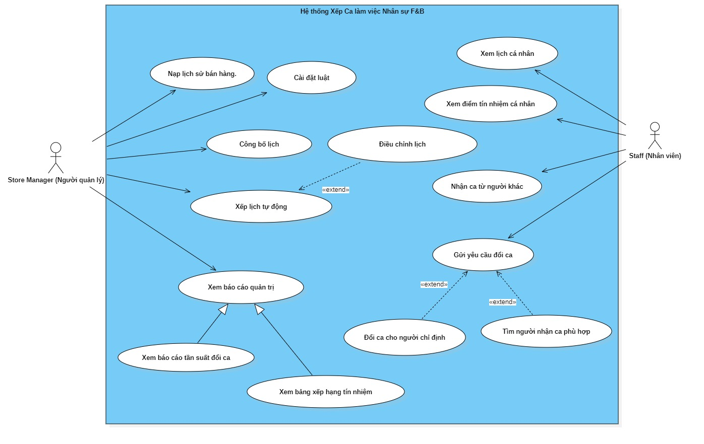
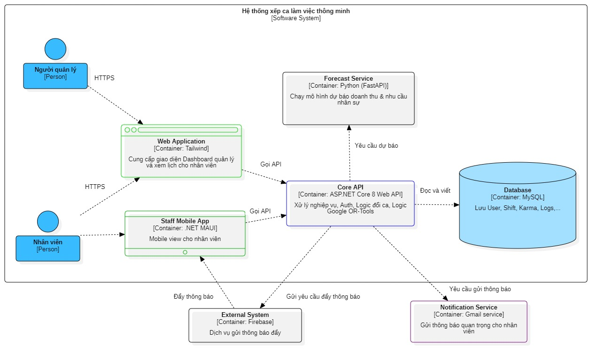
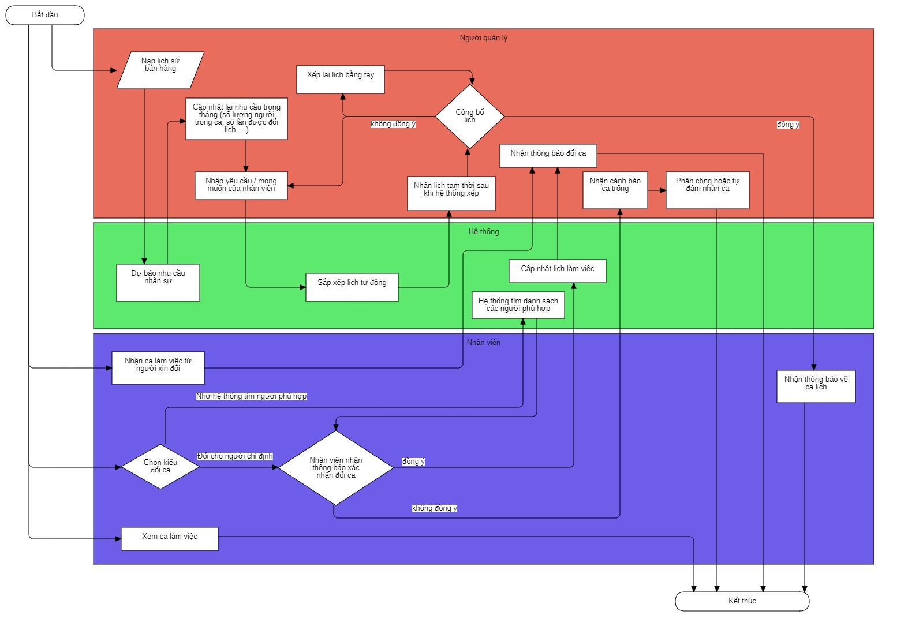
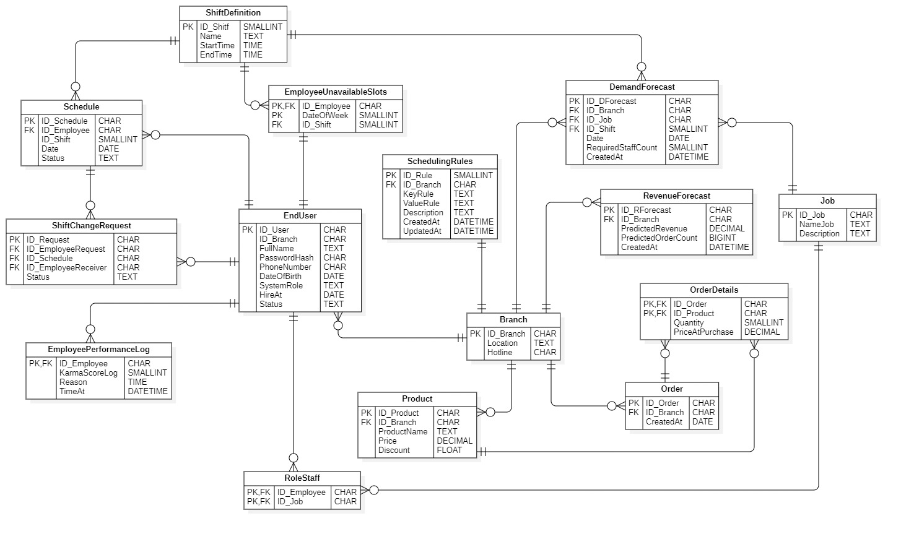

### ReadMe sẽ thay đổi trong quá trình hoàn thiện project nhằm đảm bảo chính xác những gì được mô tả (01/02/2026)

# 📅 SmartShift System - Hệ Thống Xếp Ca Làm Việc Thông Minh

## 📖 Giới thiệu dự án

**SmartShift** là hệ thống quản lý lịch làm việc tập trung, được thiết kế chuyên biệt để giải quyết bài toán phân chia ca phức tạp trong ngành F&B (mô hình chuỗi 3-5 chi nhánh).

Khác với các phần mềm chấm công truyền thống, SmartShift tích hợp **AI (Trí tuệ nhân tạo)** để dự báo nhu cầu nhân sự theo giờ và sử dụng **Thuật toán tối ưu hóa** để tự động xếp lịch, đảm bảo công bằng cho nhân viên và tuân thủ luật lao động.

## 🚀 Tính năng nổi bật

### 1. Quản trị hệ thống chuỗi (Multi-Store)
* Quản lý tập trung dữ liệu của 3-5 chi nhánh trên cùng một hệ thống.
* Phân quyền chặt chẽ: Store Manager chỉ quản lý nhân viên và lịch của cửa hàng mình.

### 2. Xếp lịch tự động (AI-Driven Scheduling)
* Tự động phân bổ ca làm việc dựa trên:
    * **Kỹ năng (Skill):** Đảm bảo mỗi ca có đủ vị trí (Pha chế, Thu ngân, Phục vụ).
    * **Khả năng đáp ứng (Availability):** Dựa trên lịch đăng ký của nhân viên.
    * **Luật lao động:** Không làm quá giờ, đảm bảo giờ nghỉ giữa các ca.

### 3. Đổi ca thông minh (Smart Shift Swap) & Marketplace
* **Tìm người thay thế:** Hệ thống tự động gợi ý danh sách nhân viên phù hợp để đổi ca.
* **Xử lý tranh chấp (Race Condition Handling):** Đảm bảo tính toàn vẹn dữ liệu khi nhiều người cùng bấm nhận một ca làm việc (Sử dụng cơ chế khóa và kiểm tra trạng thái thời gian thực).
* **Quy trình chặt chẽ:** Tích hợp phê duyệt tự động hoặc qua Quản lý tùy theo mức độ rủi ro.

### 4. Dự báo nhu cầu (Demand Forecasting)
* Sử dụng Python & Machine Learning để dự đoán số lượng khách và nhân viên cần thiết dựa trên dữ liệu lịch sử và thời tiết.

---

## 🛠 Công nghệ sử dụng (Tech Stack)

Dự án được xây dựng theo kiến trúc **Clean Architecture** (Modular Monolith), đảm bảo khả năng bảo trì và mở rộng.

| Thành phần | Công nghệ |
| :--- | :--- |
| **Backend Core** | ASP.NET Core 8 Web API |
| **Database** | MySQL (Entity Framework Core - Code First) |
| **AI Service** | Python (FastAPI, Scikit-learn, Pandas) |
| **Mobile App** | (Android/iOS) cho nhân viên |
| **Web Portal** | (Dành cho quản lý) |
| **Real-time** | Firebase Cloud Messaging (FCM) & Background Services |

---

## 📂 Tài liệu thiết kế (System Design)

Hệ thống được phân tích và thiết kế chi tiết trước khi hiện thực hóa. Các biểu đồ chi tiết nằm trong thư mục `/docs`.

### 1. Sơ đồ UseCase (UseCase Diagram)
Thiết kế chức năng có trong hệ thông.

### 1. Kiến trúc tổng thể (C4 Model)
Mô hình phân chia các Microservices và luồng dữ liệu chính.

### 2. Quy trình nghiệp vụ (Business Flowchart)
Lưu đồ thuật toán xử lý logic đổi ca và duyệt tự động.

### 3. Thiết kế chi tiết (Sequence Diagrams)
Các kịch bản tương tác chính của hệ thống:
* **[Quy trình Đổi ca chỉ định (Direct Swap)](docs/diagrams/Seq_DirectSwap.jpg)**
* **[Quy trình Đổi ca thông minh & Xử lý tranh chấp (Smart Swap)](docs/diagrams/Seq_SmartSwap.jpg)**
* **[Quy trình Hủy yêu cầu & Quản trị rủi ro](docs/diagrams/Seq_CancelRequest.jpg)**

### 4. Cấu trúc CSDL (ERD Diagram)
Sơ đồ ERD mô tả cấu trúc dữ liệu chính, mối quan hệ giữa các bảng.

---

## 🔧 Hướng dẫn cài đặt (Getting Started)

*(Dự án đang trong giai đoạn khởi tạo cấu trúc - Code First)*

---
**Thực hiện bởi: TRẦN LÂM NGHĨA**